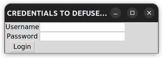

# *Solve My Bomb* Challenges for GRCon 22

## Overview

All of our challenges are independent, but there is a pseudo story to the flavortext that ties them all together. They could be revealed every few hours or after completion of the one previous. Solving the `wanted` challenge gives a hint to the `qrtree` challenge and vice-versa.

I don't know how many points per challenge is good, but we'll pretend 100 is a base value and suggest a number based on difficulty. Scale as appropriate.

## Layout

Each challenge has a `public/` folder that holds files facing the challenger, and a `private/` folder with solutions and creation files for the challenge.

## Order of Challenges

0. `000_identity/`
1. `001_wanted/`
2. `003_qrtree/`
3. `004_hexadoku/`
4. `002_bomb/` (bomb is last!)

## Flavortext

A rumor comes across your desk: a dangerous terrorist has plans to commit evil deeds. The CIA, FBI, British Secret Intelligence Service, and many more organizations from around the world have invested time, manpower, weapons, and energy into finding him, but he has stealthily evaded capture. No one outside of world intelligence leaders knows who he is or what his intentions are. All your sources are able to tell you is that this mission is a priority for the entire world. Your time has come.

