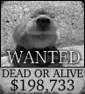
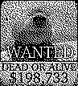

# Bounty

## Solution

### What is the bounty on the terrorist's head?

* 125 points.
* Topic: SDR
* `Flag{$198,733}` or `Flag{198733}` or `Flag{198,733}`
* Hint for 23 points: *777 samples per symbol*
* Hint for 33 points: *Bounty is outside the HAM bandplan*

### Bonus: What band composed the cat piano melody?

* 25 points.
* Topic: Trivia
* `Flag{Radiohead}`

## Explanation

The *hint* signal lets you know an image is embedded in the capture, just not where. The RF background is a big diversion and was recorded over-the-air.

The 2-FSK signal of interest is at `13945.940` KHz, offset `-179.06` Khz from the center frequency and `13.171` seconds into the capture. Once it is decoded into a string of `10379` bits, it can be reshaped into an image of `(107, 97)` and plotted. The resulting image contains a wanted poster. The semiprime length of the bits is supposed to be reminicent of the Arecibo transmission.